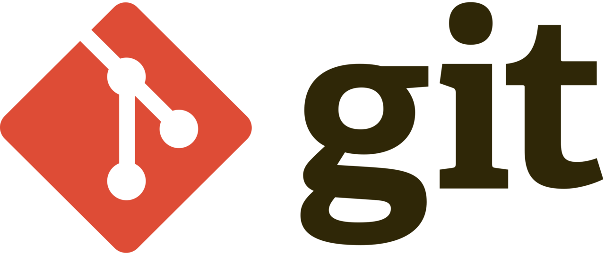

  

<!-- 
  
 -->

### What I'm using ? 🛠

I prefer react for front-end and python for back-end.
 

- 🌱 I’m addicted to learning and growing every day
- Python, React, Js, Linux, VS Code, Git, GitHub, GitLab, Jira, Agile, HTML, CSS, Django, Flask, SQL

- 💬 Ask me about anything that you want to learn via LinkedIn

-  You can reach me via Linkedin:  

## 🚴 Skills

 
 

 
 
 

## 📊 Statistics

&nbsp;
 

  

